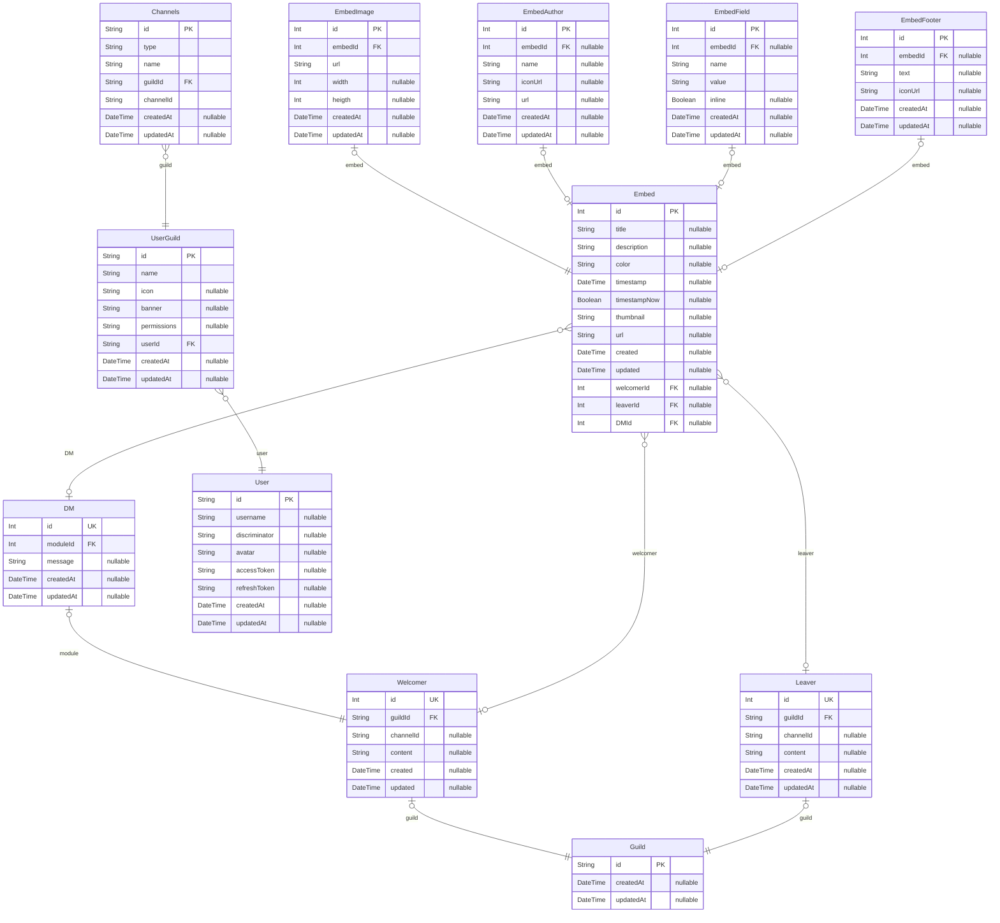

# Welcomer ERD
> Generated by [`prisma-markdown`](https://github.com/samchon/prisma-markdown)

- [default](#default)

## default

### `Guild`

**Properties**
  - `id`: 
  - `createdAt`: 
  - `updatedAt`: 

### `Welcomer`

**Properties**
  - `id`: 
  - `guildId`: 
  - `channelId`: 
  - `content`: 
  - `created`: 
  - `updated`: 

### `Leaver`

**Properties**
  - `id`: 
  - `guildId`: 
  - `channelId`: 
  - `content`: 
  - `createdAt`: 
  - `updatedAt`: 

### `DM`

**Properties**
  - `id`: 
  - `moduleId`: 
  - `message`: 
  - `createdAt`: 
  - `updatedAt`: 

### `Embed`

**Properties**
  - `id`: 
  - `title`: 
  - `description`: 
  - `color`: 
  - `timestamp`: 
  - `timestampNow`: 
  - `thumbnail`: 
  - `url`: 
  - `created`: 
  - `updated`: 
  - `welcomerId`: 
  - `leaverId`: 
  - `DMId`: 

### `EmbedImage`

**Properties**
  - `id`: 
  - `embedId`: 
  - `url`: 
  - `width`: 
  - `heigth`: 
  - `createdAt`: 
  - `updatedAt`: 

### `EmbedAuthor`

**Properties**
  - `id`: 
  - `embedId`: 
  - `name`: 
  - `iconUrl`: 
  - `url`: 
  - `createdAt`: 
  - `updatedAt`: 

### `EmbedField`

**Properties**
  - `id`: 
  - `embedId`: 
  - `name`: 
  - `value`: 
  - `inline`: 
  - `createdAt`: 
  - `updatedAt`: 

### `EmbedFooter`

**Properties**
  - `id`: 
  - `embedId`: 
  - `text`: 
  - `iconUrl`: 
  - `createdAt`: 
  - `updatedAt`: 

### `User`

**Properties**
  - `id`: 
  - `username`: 
  - `discriminator`: 
  - `avatar`: 
  - `accessToken`: 
  - `refreshToken`: 
  - `createdAt`: 
  - `updatedAt`: 

### `UserGuild`

**Properties**
  - `id`: 
  - `name`: 
  - `icon`: 
  - `banner`: 
  - `permissions`: 
  - `userId`: 
  - `createdAt`: 
  - `updatedAt`: 

### `Channels`

**Properties**
  - `id`: 
  - `type`: 
  - `name`: 
  - `guildId`: 
  - `channelId`: 
  - `createdAt`: 
  - `updatedAt`: 